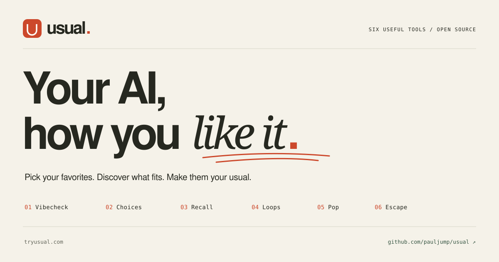

# Usual

**Your AI, how you like it.**

Useful tools for your coding agents. Pick your favorites, discover what fits, and make them your usual.

[Try the synthetic demo](https://tryusual.com/#example) · [Browse the menu](https://tryusual.com/#menu) · [Source & contributions](https://github.com/pauljump/usual)



A repeated request can become a useful change: **selected history → a cited finding → an inspected routine → a real result → a receipt → an optional setup to share.** Vibecheck is the discovery door. You can also take a single item from the menu immediately.

```sh
# From a downloaded or cloned source checkout. Python 3.11+, no pip or API key.
python3 scripts/run_flagship.py --out /tmp/my-first-usual-demo
```

Open `/tmp/my-first-usual-demo/setup.html` for the shareable card and `my-usual.private.html` for the private setup inspection. This reproducible example uses three synthetic history files, keeps a note-only exception, checks actual files twice, and installs a sanitized recipe into a separate recipient home. Its checks are deterministic; no live model or device behavior is implied.

## Pick one

<!-- usual:menu:start -->
| # | Tool | What it does | Maturity |
| --- | --- | --- | --- |
| 01 | [Vibecheck](https://tryusual.com/menu/vibecheck/) | Find useful patterns in the history you choose. | Evidence beta |
| 02 | [Choices](https://tryusual.com/menu/choices/) | Carry past decisions into the next build, with a review. | Local beta |
| 03 | [Recall](https://tryusual.com/menu/recall/) | Find what was said, with the source attached. | Adapter beta |
| 04 | [Loops](https://tryusual.com/menu/loops/) | Make one recurring method easy to run again. | Scoped routine beta |
| 05 | [Pop](https://tryusual.com/menu/pop/) | Get links in the format and browser you prefer. | Rule beta |
| 06 | [Escape](https://tryusual.com/menu/escape/) | Help website visitors leave an in-app browser. | Pinned upstream widget |
<!-- usual:menu:end -->

À la carte means independently useful. History and Choices are optional. Each item declares its changes, storage, configuration, source and verification in the [versioned catalog](src/usual/catalog.json).

**Try Pop on its own:**

```sh
python3 scripts/usual.py pop use 'https://example.com' --browser both
```

To install the instruction into your coding client, inspect the source, then run:

```sh
python3 scripts/usual.py pop install --client codex --browser both
# Or --client claude. Use --project /path/to/project for a project-only rule.
```

Pop preserves unrelated instructions and refuses conflicting edits. It needs no decision database, history import, Usual skill installation or account. [Agent installation instructions](https://tryusual.com/pop/install) keep the existing simple URL. Custom iOS schemes are candidates to check on the actual device; ordinary desktop links use the default browser.

## Find my usual

Install the portable skill for your client:

```sh
python3 install.py --client codex
# Or --client claude / --client both. --home /tmp/test-home isolates installation.
```

Then ask your current agent to **find my usual from a selected history folder**. Choose that scope explicitly. The public website cannot access local files or connect itself to your agent. These commands run on the machine holding the history:

```sh
python3 scripts/usual.py vibecheck scan --source /path/to/selected-history
python3 scripts/usual.py vibecheck handoff REPORT_ID
```

The scan returns up to three cautious findings with source lines, dates, context, exceptions and limits. A file handoff lets the active agent interpret bounded evidence; `vibecheck import REPORT_ID --file report.json` validates its citations. You can inspect, correct or dismiss findings. No engineering grade, percentile or universal preference is inferred from activity.

A finding does not install or execute anything. Inspect the proposed change, select its scope, use it, and read the resulting receipt. [History commands and limits](references/history.md) · [Loops commands](references/loops.md).

## My Usual

Tool selections, configuration, scope, installation state and verification persist separately from private historical evidence:

```sh
python3 scripts/usual.py setup install loops --scope /path/to/project
python3 scripts/usual.py loops create release-files --scope /path/to/project --file README.md --file manifest.json
python3 scripts/usual.py loops preview release-files --label 'Release review'
python3 scripts/usual.py loops run release-files --label 'Release review'
python3 scripts/usual.py setup inspect
python3 scripts/usual.py setup inspect --format html --out /tmp/my-usual.private.html
```

Loops' first maintained method checks explicitly selected files, JSON validity and optional expected hashes. It is editable, invocable and bounded; it does not invent or execute arbitrary project commands. A receipt proves those file checks, not application correctness or permission to release.

Use `setup configure`, `setup disable` and `setup remove` to adjust selections. Pop updates use `pop install` again; modified managed blocks are preserved for reconciliation. Loops uses `loops edit`, `disable`, `enable` and `remove`; corrections preserve previous versions. Escape installs its pinned asset and license; you explicitly add or remove its script tag. [Setup and removal details](references/collection.md).

## Share the selection

```sh
# Default export: module IDs and versions only, after review.
python3 scripts/usual.py setup export --reviewed --out /tmp/setup.json --html /tmp/setup.html
# Include an explicitly reviewed safe option: --include-config pop.browser

# Recipient: inspect, choose your own scope, then select and install deliberately.
python3 scripts/usual.py setup import /tmp/setup.json
python3 scripts/usual.py setup import /tmp/setup.json --scope /path/to/my-project --reviewed
python3 scripts/usual.py setup install pop --scope /path/to/my-project
```

A recipe excludes transcripts, source quotes, paths, private project names, permissions, private routines and unreviewed preferences. Import does not run code or install instructions. There is no public sharing backend. A recipient adapts environment-specific choices locally.

## Already using Usual or Whetstone?

**Choices is a menu label.** `$usual`, `/usual`, `onboard`, `mine`, `episodes`, `start`, `consult`, `record`, `finish`, `review`, `review-ui`, modes and `--db` keep their meanings. The existing `~/.usual/judgment.sqlite3` remains intact; new selections use separate files. Existing Whetstone migration and backup compatibility remain supported.

[Choices runtime and permissions](references/runtime.md) · [Onboarding](references/onboarding.md) · [Migration](references/migration.md) · [Decision-review demo](references/demo.md).

Recall answers **what was said**, with citations. Choices asks the current agent **which historical decision applies now**, then records and reviews the resulting choice. Neither historical approvals nor passing checks create new authority.

## Privacy and compatibility

This is a **local beta**. Codex and Claude native JSONL adapters, Python runtime behavior, managed instruction installs and synthetic browser clients have local test coverage. Fresh live-agent sessions, new operating systems and additional physical devices need separate validation. [Exact verification boundaries](references/verification.md).

Parsing, indexing, storage and receipts run locally with Python's standard library. Derived data belongs outside source repositories. Usual makes no model API calls and sends no CLI telemetry. **Evidence given to a hosted coding agent goes through that provider's normal handling and consumes its usual model usage.** Local storage does not make inference offline.

The new collection pages have no third-party browser scripts. Existing legacy pages retain disclosed browser analytics; the public hosting layer may collect visit/performance data. The public site contains synthetic examples and source downloads, never a private corpus endpoint. [Privacy](https://tryusual.com/privacy/).

Escape is a pinned MIT upstream dependency with one documented integration patch; its original repository stays canonical. Recall adapts Transcript Mine's local core into one maintained Usual implementation. Vibecheck's former material remains guide/reference material; it does not establish engineering quality. [Source provenance](references/provenance.md).

## Build and contribute

```sh
python3 -m pytest -q
python3 scripts/validate_catalog.py
python3 scripts/run_flagship.py --out /tmp/usual-flagship
python3 scripts/build_release.py
PYTHONPATH=src python3 -m usual.server --autopilot-public --host 127.0.0.1 --port 8876
```

Release downloads are built from an explicit source allowlist with SHA-256 contents. Private data, experiments, credentials and research are excluded. The current local work requires review before publication to the canonical `tryusual.com` route.

[Contribute an item or adapter](CONTRIBUTING.md), reproduce a failure, or generalize a useful routine. The [minimal contributor example](examples/catalog/) includes its own validation command. If Usual is useful, a voluntary [GitHub star](https://github.com/pauljump/usual) helps others find the collection.

MIT · [Original Itchy research](archive/itchy/README.md) · [Project evolution](references/evolution.md)
